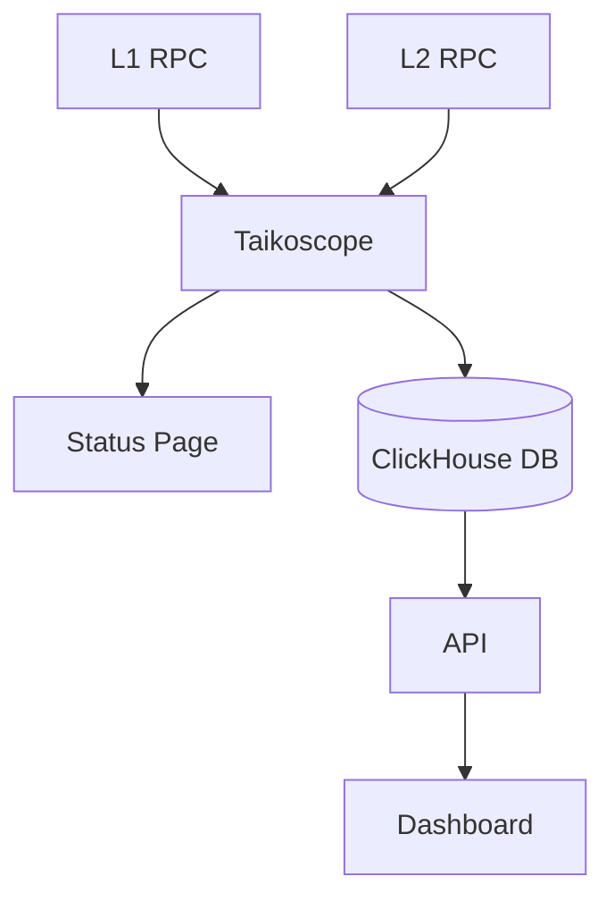

# Taikoscope 🔭

Taikoscope is a real‑time monitoring and analytics system for the Taiko
blockchain. It continuously ingests events from Ethereum (L1) and Taiko (L2),
persists time‑series metrics in ClickHouse and exposes them via a REST API and a
React dashboard.


## Table of Contents

1. [Requirements](#requirements)
2. [Quick Start](#quick-start)
3. [Environment](#environment)
4. [Architecture](#architecture)
5. [Development](#development)
6. [Deployment](#deployment)
7. [License](#license)

## Requirements

- [Rust](https://www.rust-lang.org/) (2024 edition)
- [just](https://github.com/casey/just)
- A running ClickHouse instance
- Access to L1 and L2 RPC endpoints
- Node.js (for the dashboard)

## Quick Start

1. Clone the repository and install dependencies.
2. Run `just install-dashboard` to fetch dashboard packages.
3. Copy `dev.env` and adjust the values for your setup or provide your own env
   file via the `ENV_FILE` variable.
4. (Optional) Start ClickHouse and the dashboard via Docker Compose:

   ```bash
   docker compose up
   ```

5. Start the taikoscope binary and API server:

   ```bash
   just dev         # runs the Taikoscope binary
   just dev-api     # runs the HTTP API
   ```

6. Start the dashboard (optional if not using Docker Compose):

   ```bash
   just dev-dashboard
   ```

   To test without database writes (dry-run mode):

   ```bash
   just dev-dry-run  # runs with ENABLE_DB_WRITES=false
   ```

The API is now available on `http://localhost:3000` and the dashboard on
`http://localhost:5173` by default.

## Environment

All configuration is provided via environment variables. The most relevant
variables are shown below. See [`crates/config`](crates/config) for the full
list.

```text
CLICKHOUSE_URL=<http://localhost:8123>
CLICKHOUSE_DB=taikoscope
L1_RPC_URL=<l1-endpoint>
L2_RPC_URL=<l2-endpoint>
TAIKO_INBOX_ADDRESS=<0x...>
TAIKO_PRECONF_WHITELIST_ADDRESS=<0x...>
TAIKO_WRAPPER_ADDRESS=<0x...>
INSTATUS_PUBLIC_API_COMPONENT_ID=
API_HOST=127.0.0.1
API_PORT=3000
RATE_LIMIT_MAX_REQUESTS=1000
RATE_LIMIT_PERIOD_SECS=60
```

These variables map to the configuration structs defined in
[`crates/config`](crates/config) (`ClickhouseOpts`, `RpcOpts`,
`TaikoAddressOpts`, `ApiOpts` and `InstatusOpts`).

## Architecture

Taikoscope follows a layered architecture that keeps data ingestion and
presentation concerns separate:

1. **Taikoscope Binary** – a single binary that subscribes to L1 and L2 chains,
   processes events in real-time, and writes them directly to ClickHouse via the
   `ClickhouseWriter`. Includes gap detection and backfill for finalized data.
2. **Storage** – a ClickHouse database holds tables like
   `l1_head_events`, `l2_head_events`, `batches` and `proved_batches`. Reads and
   writes use dedicated reader and writer clients.
3. **API Server** – an Axum based service exposing 20+ REST endpoints and
   Server‑Sent Events. `ApiState` manages database access and IP based rate
   limiting.
4. **Dashboard** – a React application that fetches metrics using the API
   service layer and renders them with lazy loaded charts.
5. **Monitoring** – background monitors trigger incidents via Instatus when
   thresholds are exceeded.

Events flow through the system continuously. The taikoscope binary subscribes to
L1/L2 events, processes them in real-time, and inserts rows into ClickHouse.
The API aggregates this data for the dashboard, which polls periodically to
update metrics.

## Development

Formatting, linting and tests can be run via `just`:

```bash
just fmt      # format the code
just lint     # run clippy
just lint-dashboard # check dashboard whitespace
just test     # run the test suite
just ci       # runs fmt, lint, lint-dashboard and test
```

## Deployment

Deployment scripts use `ssh` and `docker` to build the images remotely.
Create an entry in your `~/.ssh/config` (for example named `taiko`) and then run:

```bash
just deploy-remote-hekla        # deploy the taikoscope binary
just deploy-api-remote-hekla    # deploy the API server
```

To deploy the Hekla dashboard:

```bash
git switch hekla
git pull --rebase origin main
git push origin hekla
```

Vercel automatically builds and deploys the dashboard after the push.

## Architecture



## License

Licensed under the MIT license. See [`LICENSE`](LICENSE) for details.
